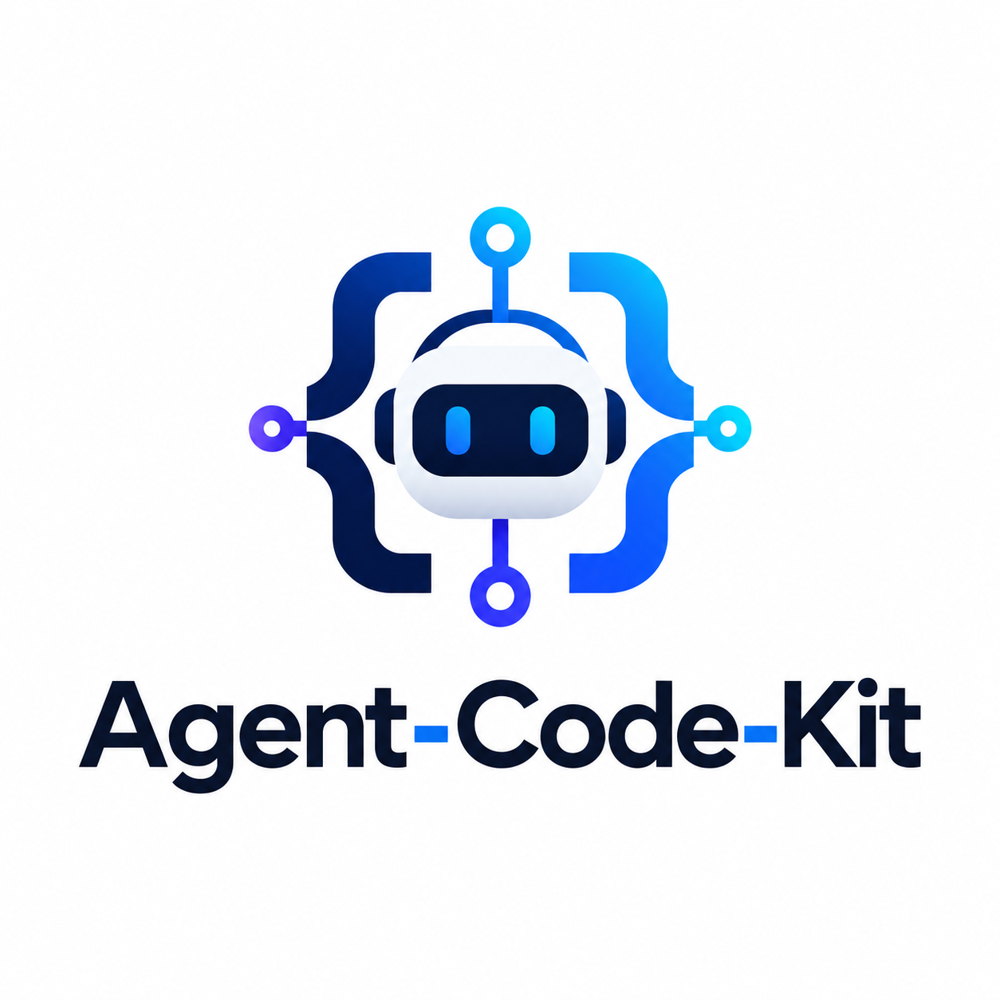

<p align="center">
  
</p>

<h1 align="center">Welcome to Agent Code Kit 👋</h1>

<p align="center">
  <a href="https://www.npmjs.com/package/@lucasfelipe23/agent-code-kit">
    
  </a>
  <a href="https://www.npmjs.com/package/@lucasfelipe23/agent-code-kit">
    
  </a>
  <a href="#prerequisites">
    
  </a>
  <a href="https://github.com/lucasfelipe24/agent-code-kit/actions/workflows/validate.yml">
    
  </a>
  <a href="https://github.com/lucasfelipe24/agent-code-kit/graphs/commit-activity">
    
  </a>
  <a href="LICENSE">
    
  </a>
  <a href="README.pt-BR.md">
    
  </a>
</p>

> **Guardrails for Claude Code.** It plans before it codes, stays inside the scope you approved, and can't call a task done while a check is failing.

<p align="center">
  <a href="#-demo">Demo</a> ·
  <a href="#-quick-start">Quick start</a> ·
  <a href="#-how-it-works">How it works</a> ·
  <a href="#-skills-and-agents">Skills</a> ·
  <a href="#-configuration">Configuration</a> ·
  <a href="#-faq">FAQ</a>
</p>

```bash
npx @lucasfelipe23/agent-code-kit init
```

## ✨ Demo

Ask for "Add a search feature to the users page" without the kit, and you get three new packages, a refactored users module you didn't ask for, and a broken build nobody checked.

With the kit:

```text
You:    Add a search feature to the users page

Claude: I've read CODEBASE_MAP.md — the page is app/(dashboard)/users/page.tsx and
        the data comes from src/services/user.service.ts. This touches 3 files,
        so here's the plan:

        1. Handle a search param in users/page.tsx
        2. Add searchUsers() to user.service.ts
        3. Add a search input component (new file)

        Should I proceed?

You:    Yes

Claude: [implements, then runs]
        tsc --noEmit ✓   eslint ✓   npm test ✓   opened the page, search works ✓
        Done — all checks passed.
```

## 🤔 Why

Claude Code is capable, but eager. Left alone, it will:

- start editing before it understands your codebase
- "improve" files you never asked it to touch
- add a dependency or change your schema without asking
- say "done" without running a single check
- repeat the mistake you corrected yesterday

A prompt that says "don't do that" helps — until the model skips it. Agent Code Kit ships the rules **and** the enforcement behind them.

## 🚀 Quick start

### Prerequisites

- [Claude Code](https://code.claude.com/docs)
- Node.js 18 or later
- bash — macOS, Linux, or WSL on Windows

### Install

Run this in your project root:

```bash
npx @lucasfelipe23/agent-code-kit init
```

The installer detects your stack and picks a matching [template](#stack-templates).

<details>
<summary>Prefer not to use Node.js? Install with curl</summary>

The installer runs straight from GitHub (it needs git and bash):

```bash
curl -fsSL https://raw.githubusercontent.com/lucasfelipe24/agent-code-kit/main/install.sh | bash
```

Pass the same options after `bash -s --`, for example `| bash -s -- --profile strict`, or `--version v1.22.3` for a specific release.

</details>

### Usage

1. **Describe your project** in `CODEBASE_MAP.md`: what it does, where things live, how to run it. Claude reads it at the start of every session, so the better it is, the better Claude works. `./scripts/validate.sh` lists the placeholders you haven't filled in.

2. **Check the install:**

   ```bash
   npx @lucasfelipe23/agent-code-kit doctor
   ```

   Doctor checks the files and settings, then runs a self-test of the hooks in a scratch project.

3. **Start Claude Code** as usual. There's no new command to learn — the rules and hooks are already active.

## 🧩 How it works

The kit adds four layers to your project:

| Layer | What it is | What it does |
|---|---|---|
| **Rules** | `CLAUDE.md` | A fixed workflow — plan, confirm, implement, verify — that Claude follows in every session |
| **Guardrails** | 28 hooks that Claude Code runs on each action | Block what the rules forbid: editing secrets, pushing to `main`, finishing while a check fails |
| **Skills & agents** | 37 skills and 6 subagents | Audits, debugging, reviews and releases — run when you ask |
| **Memory** | `tasks/` | The plan, decisions, lessons and handoffs that carry over between sessions |

Rules are advice. Hooks are enforcement: they run outside the model, on every matching action, whether or not it remembers the rule.

## 📏 The rules

`CLAUDE.md` gives Claude a workflow to follow in every session:

| Rule | What Claude does |
|---|---|
| **Plan first** | For changes across 3+ files, writes a plan to `tasks/todo.md` and waits for your go-ahead |
| **Scope discipline** | Touches only what the task needs; logs anything else it notices under "Not Now" |
| **Protected changes** | Stops before new dependencies, schema, API, auth or build changes; presents options and records your choice as a decision |
| **Verification** | Runs typecheck, lint, tests and a smoke test, in that order, before calling a task done |
| **Lessons** | When you correct it, writes a lesson to `tasks/lessons/` and reviews the top rules at the start of each session |
| **Tiered context** | Loads the project map every session, the plan and handoff only when continuing, and lessons and decisions only when relevant |

Put your own rules in `CLAUDE.project.md` — they override the kit's.

## 🚧 Guardrails

Hooks are shell scripts Claude Code runs at fixed points: before a tool call, after an edit, when Claude tries to finish. A blocking hook stops the action and tells Claude why.

| Hook | What it blocks |
|---|---|
| `protect-files` | Edits to `.env` files, credentials, private keys and lock files |
| `protect-changes` | Edits to dependency manifests, migrations, auth code and CI workflows until you've approved the change |
| `branch-protect` | Pushes to `main`/`master`, and force pushes |
| `block-dangerous-commands` | `rm -rf /`, `git reset --hard`, `DROP TABLE` and similar |
| `conventional-commit` | Commit messages that don't follow [Conventional Commits](https://www.conventionalcommits.org/) |
| `quality-gate` + `stop-gate` | Finishing while the typecheck, lint or syntax check of an edited file is failing |
| `mcp-gate` | Calls to MCP servers that aren't on your allowlist (off until you create `.claude/mcp-allowlist.txt`) |

The default profile turns on 23 of the 28 hooks. The ones not listed above watch instead of block: they warn about secrets and invisible Unicode in edits, spot edit loops and oversized tool output, re-inject your plan after a context compaction, and keep a session log for `/scorecard`. After install, `agent_docs/hooks.md` describes every hook and how to write your own.

The hooks are tested — see [Run tests](#-run-tests).

## 🧰 Skills and agents

Skills are commands you run in Claude Code with `/name`. Some good ones to start with:

| Skill | What it does |
|---|---|
| `/capabilities` | Shows everything the kit makes available in this project |
| `/debug` | Finds the root cause before touching code, then adds a regression test |
| `/review-pipeline` | Runs several audits over your diff in parallel and merges the findings into one report |
| `/ship` | Tests, changelog, clean commits and a pull request |
| `/office-hours` | Clarifies what to build and why, before any code |

<details>
<summary>All 37 skills</summary>

**Plan**

| Skill | What it does |
|---|---|
| `/office-hours` | Clarifies what to build and why, before any code |
| `/shape-spec` | Creates a spec folder for a feature that spans several sessions |
| `/interface-design` | Has parallel subagents design competing interfaces, then compares them |
| `/feature-cycle` | Runs spec → plan → build → verify → review → ship end to end, stopping at any failed gate |

**Build and debug**

| Skill | What it does |
|---|---|
| `/debug` | Finds the root cause before touching code, then adds a regression test |
| `/ui-component-builder` | Builds a UI component with accessibility, loading/empty/error states and responsive layout |
| `/refactoring-guide` | Plans a refactoring step by step, with the risk of each step |
| `/web-read` | Turns a web page into clean markdown, using fewer tokens than a raw fetch |

**Review and audit**

| Skill | What it does |
|---|---|
| `/review-pipeline` | Runs several audits over your diff in parallel and merges the findings into one report |
| `/code-quality-audit` | Code smells, error handling and maintainability |
| `/architecture-review` | Module boundaries, dependencies and SOLID |
| `/deepening-review` | Finds shallow, pass-through modules and works through the one you pick |
| `/performance-audit` | Startup, rendering, memory and I/O bottlenecks |
| `/testing-audit` | Test coverage, quality and flaky tests |
| `/dead-code-audit` | Unused functions, imports and files |
| `/dependency-audit` | Vulnerabilities, outdated versions, licenses and bloat |
| `/accessibility-audit` | WCAG 2.2 AA compliance |
| `/design-review` | Visual consistency and responsive behavior of a built UI |
| `/documentation-audit` | Comment, API doc and README quality |
| `/doc-gardening` | Docs that have drifted from the code |
| `/mcp-audit` | Your MCP servers against the allowlist, with their risks |
| `/quality-audit` | Your code against your `golden-principles.yaml` |
| `/project-health-report` | A whole-project snapshot across all of the above |

**Ship**

| Skill | What it does |
|---|---|
| `/ship` | Tests, changelog, clean commits and a pull request |
| `/verification-status` | Which checks ran for the current task, plus the manual ones still owed |

**Memory and reports**

| Skill | What it does |
|---|---|
| `/note` | Saves a finding or decision so it survives a context compaction |
| `/lesson-refresh` | Reviews `tasks/lessons/`: keep, update, promote or archive each lesson |
| `/lesson-resurface` | Finds archived lessons related to the current task |
| `/pulse` | What shipped, broke and was learned over a period |
| `/retro` | A weekly retrospective |
| `/scorecard` | Session numbers: gate pass rate, blocks fired, output budget |

**Project setup**

| Skill | What it does |
|---|---|
| `/constitution` | Writes your project's `golden-principles.yaml` |
| `/harness-init` | Scaffolds a `docs/` structure (architecture, plans, quality score) |
| `/references-sync` | Pulls library docs into `docs/references/` so Claude reads them locally |
| `/skill-generator` | Generates skills tailored to your stack |
| `/skill-extractor` | Turns something learned in a session into a reusable skill |

</details>

List them from the terminal with `npx @lucasfelipe23/agent-code-kit skills`. The optional wiki module adds `/wiki-ingest`, `/wiki-lint` and `/wiki-briefing`.

**Subagents** Claude can hand work to:

| Agent | What it does |
|---|---|
| `code-reviewer` | Reviews for correctness, maintainability and performance |
| `security-reviewer` | Looks for vulnerabilities |
| `qa-reviewer` | Checks a task against its completion criteria, with evidence |
| `planner` | Turns a task into an implementation plan |
| `devils-advocate` | Tries to break a change: hidden assumptions, inputs that fail it |
| `dead-code-remover` | Removes code it has verified is unused |

## 📦 What gets installed

Everything goes into your project directory, where you can read and edit it. Nothing is installed globally.

| Path | What it is | Upgrades |
|---|---|---|
| `CLAUDE.md` | The workflow rules | Updated, unless you've edited it |
| `CLAUDE.project.md` | Your project's own rules | Never touched |
| `CODEBASE_MAP.md` | Your project's map — fill it in | Never touched |
| `agent_docs/` | Guides Claude reads when relevant: workflow, debugging, testing, hooks | Updated, except `agent_docs/project/` (yours) |
| `.claude/hooks/` | The 28 hook scripts | Updated, except `.claude/hooks/project/` (yours) |
| `.claude/skills/`, `.claude/agents/` | Skills and subagents | Updated |
| `.claude/settings.json` | Which hooks run, and allow/deny lists for commands | Never touched |
| `tasks/` | Plan, decisions, lessons and handoffs — Claude writes here as it works | Never touched |
| `scripts/` | `doctor.sh`, `statusline.sh`, `convert.sh` and other helpers | Updated |
| `.kit-manifest`, `.kit-baseline` | What the kit installed, so upgrades and uninstall touch only its files | Rewritten |

If your project already has a `CLAUDE.md` or `CODEBASE_MAP.md`, the installer keeps yours and asks before continuing.

## 🔧 Configuration

### Profiles

```bash
npx @lucasfelipe23/agent-code-kit init --profile strict
```

| Profile | What you get |
|---|---|
| `standard` (default) | Rules, docs, skills, agents and 23 hooks |
| `minimal` | Hooks only — no `CLAUDE.md` or docs |
| `strict` | Standard, plus the 5 opt-in hooks (auto-lint, auto-format, skill-compliance, skill-extract-reminder, notify-waiting); edits to build configs also need approval |

### Stack templates

Each template adds stack-specific rules to `CLAUDE.md` and a pre-filled `CODEBASE_MAP.md`. The installer picks one from your project files (`next.config.*`, `go.mod`, `Cargo.toml`, `*.sln`/`*.csproj`, `manage.py`, `requirements.txt`, `package.json`); choose one yourself with `--template <name>`.

| Template | Stack | Adds rules for |
|---|---|---|
| `nextjs` | Next.js 16, App Router, Prisma, Tailwind | Server vs client components, build verification |
| `node-api` | Express, TypeScript, Knex.js | Layered architecture, API design |
| `python-fastapi` | FastAPI, SQLAlchemy 2.0, Pydantic v2 | Async patterns, dependency injection, Alembic |
| `django` | Django (+ DRF) | Fat models, migration discipline, N+1 queries |
| `go` | Go modules | Error wrapping, context propagation, `-race` tests |
| `rust` | Cargo | `Result`/`?` over `unwrap`, clippy `-D warnings`, `unsafe` gating |
| `dotnet` | C#, ASP.NET Core, EF Core | Nullable references, `CancellationToken`, EF migrations |

### Optional modules

| Flag | Adds |
|---|---|
| `--wiki` | A knowledge wiki Claude builds from sources you add, with `/wiki-ingest`, `/wiki-lint` and `/wiki-briefing` |
| `--html` | Conventions for writing specs, plans and reports as HTML pages instead of markdown |
| `--gitignore` | Adds the kit's files to `.gitignore`, to keep the kit local instead of committing it |

<details>
<summary>Tell the checks how to run</summary>

By default the quality gate detects your typecheck and lint commands. To set them yourself, copy `.claude/commands.json.example` to `.claude/commands.json`:

```json
{
  "typecheck": "pnpm -w typecheck",
  "lint": "pnpm -w lint",
  "test": "pnpm -w test",
  "build": "pnpm -w build"
}
```

`typecheck` and `lint` run after every edit, so keep them fast. `test` and `build` run only for `/ship` and reviews.

</details>

<details>
<summary>Turn a hook on or off</summary>

Hooks are listed in `.claude/settings.json`: remove an entry to turn that hook off. `agent_docs/hooks.md` shows how to add the opt-in ones. The same file holds the allow and deny lists for commands — test runners and linters are allowed; `curl`, `wget`, reading `.env` and `npm publish` are denied.

</details>

<details>
<summary>Status line</summary>

`scripts/statusline.sh` shows the model, branch, context use and session cost at the bottom of Claude Code. Add it to `.claude/settings.json` ([status line docs](https://code.claude.com/docs/en/statusline)):

```json
{
  "statusLine": {
    "type": "command",
    "command": "./scripts/statusline.sh"
  }
}
```

```text
Opus | feat/search | ███████░░░ 78% | $1.24
```

</details>

## 🔄 Upgrade

```bash
npx @lucasfelipe23/agent-code-kit@latest init --upgrade
```

- Kit files you haven't edited are updated.
- Kit files you've edited are kept. If the kit changed them too, its version is saved next to yours as `<file>.kit-new` for you to merge.
- Your files — `CODEBASE_MAP.md`, `CLAUDE.project.md`, `tasks/`, `.claude/settings.json` and the `project/` folders — are never touched.

Add `--diff` to preview an upgrade: it runs on a scratch copy and reports what would change, without writing to your project. To install a specific version, put it in the package name: `npx @lucasfelipe23/agent-code-kit@1.22.2 init`.

## 🧹 Uninstall

```bash
npx @lucasfelipe23/agent-code-kit uninstall --dry-run   # list what would be removed and kept
npx @lucasfelipe23/agent-code-kit uninstall             # remove, after you confirm
```

Only the kit's files are removed. Files you added to shared folders like `scripts/` or `.claude/skills/` stay, and so does `CODEBASE_MAP.md` once you've filled it in. `tasks/` and your overlay (`CLAUDE.project.md` and the `project/` folders) are removed by default — the uninstaller warns you when `tasks/` holds your work — so keep them with `--keep-tasks` and `--keep-project`.

Installed with curl? `curl -fsSL https://raw.githubusercontent.com/lucasfelipe24/agent-code-kit/main/uninstall.sh | bash -s -- --dry-run` works the same way, except that it can't compare files with the kit's own copies, so it always keeps `CODEBASE_MAP.md`.

## 🔌 Other AI tools

The rules travel to other tools; the hooks don't, because they depend on Claude Code's hook system.

| Command | Writes |
|---|---|
| `npx @lucasfelipe23/agent-code-kit convert cursor` | `.cursor/rules/` |
| `npx @lucasfelipe23/agent-code-kit convert windsurf` | `.windsurf/rules/` |
| `npx @lucasfelipe23/agent-code-kit convert aider` | `CONVENTIONS.md` and `.aider.conf.yml` |
| `npx @lucasfelipe23/agent-code-kit convert agents-md` | [`AGENTS.md`](https://agents.md/), read by Codex, Copilot, Jules and others |
| `npx @lucasfelipe23/agent-code-kit convert skills` | The skills in `.agents/skills/`, read by Codex, Zed and Amp |
| `npx @lucasfelipe23/agent-code-kit convert codex` | `AGENTS.md` plus the skills in `.agents/skills/` |
| `npx @lucasfelipe23/agent-code-kit convert all` | All of the above |

Already have rules for another tool? `convert import` gathers them into `tasks/imported-rules.md` for you to review and move into `CLAUDE.project.md`.

## 🤖 Auto mode and /loop

Claude Code's auto mode approves routine actions without asking. The kit is what makes that safe: its blocking hooks and deny list run before auto mode's classifier, and the classifier can only add restrictions, never lift them. The same holds for unattended `/loop` runs. After install, see `agent_docs/auto-mode.md`.

## ❓ FAQ

<details>
<summary><b>Will it overwrite my <code>CLAUDE.md</code>?</b></summary>

No. If you already have one, the installer keeps it and asks before continuing. To adopt the kit's rules later, move yours into `CLAUDE.project.md`, delete `CLAUDE.md` and run `npx @lucasfelipe23/agent-code-kit init --upgrade`.

</details>

<details>
<summary><b>Does it send my code anywhere?</b></summary>

No. The kit's hooks and scripts run locally and don't phone home. The only network call they make is an optional push notification when Claude is waiting for you (ntfy or Pushover), off unless you set it up.

</details>

<details>
<summary><b>A check is failing for a reason unrelated to my task. Is Claude stuck?</b></summary>

Set `SKIP_QUALITY_GATE=1` to let it finish. Use it for broken infrastructure, not to skip a real failure.

</details>

<details>
<summary><b>Should I commit the kit's files?</b></summary>

Committing them gives everyone on the team the same rules, hooks and memory. To keep the kit to yourself, install with `--gitignore`.

</details>

<details>
<summary><b>Does it work on Windows?</b></summary>

Through WSL. The installer and the hooks are bash scripts.

</details>

## 🧪 Run tests

The hooks are tested. The kit's repository runs a regression harness with 157 scenarios — each blocking behavior plus tests for past bugs — on every change. From a clone of the repository:

```bash
npm test        # KitBench hook scenarios, then the install/uninstall and CLI tests
npm run check   # manifest, scaffold, strict-settings, AGENTS.md and skill checks
```

```text
KitBench
  s01-protect-files-blocks-env              PASS
  s31-branch-protect-blocks-push-u-main     PASS
  s52-quality-gate-fix-unblocks-stop        PASS
  ...
  157/157 PASS  0 FAIL
```

## 👤 Author

**Lucas Felipe**

- GitHub: [@lucasfelipe24](https://github.com/lucasfelipe24)

## 🤝 Contributing

Agent Code Kit is a solo project: it's built and maintained by one person, so it doesn't take outside issues or pull requests. Found a security problem? Report it privately through [GitHub's vulnerability reporting](https://github.com/lucasfelipe24/agent-code-kit/security/advisories/new).

## Show your support

Give a ⭐️ if this project helped you!

## 📝 License

Copyright © 2026 [Lucas Felipe](https://github.com/lucasfelipe24).<br />
This project is [MIT](LICENSE) licensed.
